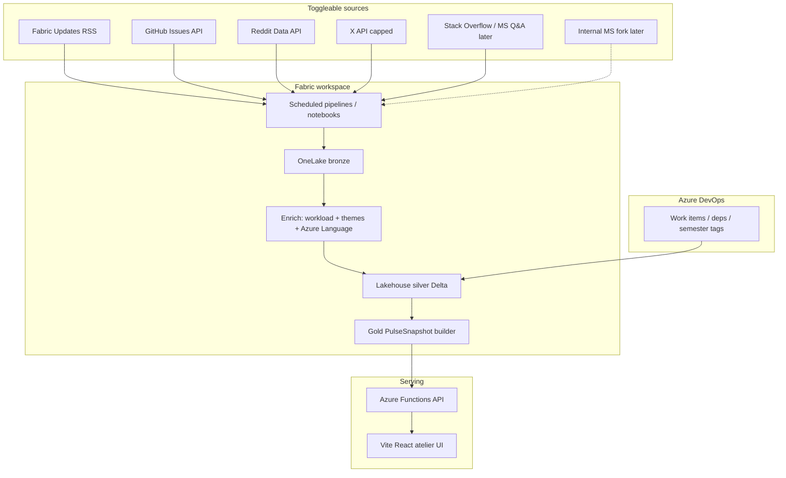
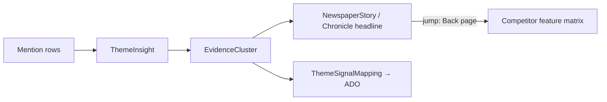
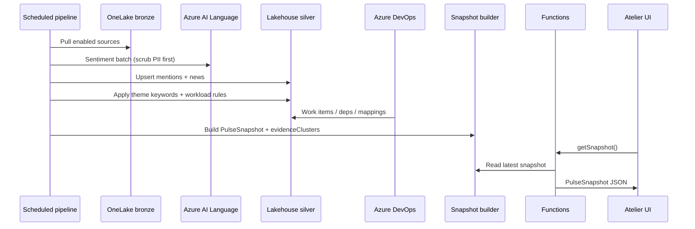

# Fabric Pulse — Strategy & Architecture

**Audience:** Engineering + PM  
**Status:** Recommended production plan (beyond the UI prototype)  
**Date:** 2026-09-13  
**Grounded in:** `docs/PRODUCT-NORTH-STAR.md`, `docs/PROVIDERS.md`, `src/types.ts`, `src/data/provider.ts`, `src/data/README.md`, `SYNTHETIC-DATA-REPORT.md`, `market-research/EXECUTIVE-SUMMARY.md`, `market-research/fabric-pipelines-adf-sources.md`, `market-research/pricing-buy-vs-build.md`

> This is a plan, not a description of shipped backend code. Today the app is a Vite/React client with `MockPulseDataProvider` loading synthetic `corpus.json`. There is **no** ingestion pipeline or serving API yet — those are recommended below.
>
> **Prototype status (UI):** Evidence badges + verbatim sheet (derived counts), Chronicle competitor back page (Pipelines starter rivals), and toggleable Sources panel (localStorage) are wired in the atelier demo. Counts come from the snapshot, not random labels.

---

## 0. Product frame (do not re-litigate)

From the north star and README:

1. Help Fabric product teams answer, per **workload** and optional **cloud boundary**: what customers want, what they dislike, and whether ADO already covers it (covered / partial / gap).
2. **Default = product-general (commercial / All).** USGov / USNat / USSec are narrow-downs, not the default story.
3. Presentation stays **atelier / sparse** (Weather, Letter, Newspaper, Coverage, Dossier…). Cloud + ADO = pills, not KPI walls.
4. Data plane is a stable `PulseDataProvider` → `PulseSnapshot` contract. UI does not fork when sources change.

---

## 1. Backend architecture — pick a stack

### Recommendation (opinionated)

**MVP: Fabric lakehouse + scheduled notebooks/pipelines + thin Azure Functions API + OneLake-backed snapshot.**

| Layer | Choice | Why |
| --- | --- | --- |
| **Ingest** | Fabric Data Factory pipelines (or Fabric notebooks on a schedule) calling **official APIs / RSS only** | Native to the product surface we care about; same CU/workspace mental model as Pipelines customers; no new “mystery” orchestration product |
| **Raw / bronze** | Lakehouse tables / Files in OneLake (`pulse/bronze/{source}/…`) | Cheap append-only provenance; easy to reprocess |
| **Curated / silver** | Lakehouse Delta tables: `mentions`, `theme_hits`, `news_items`, `ado_*` | Queryable; matches snapshot shapes |
| **Enrichment** | Notebook job: workload rules + theme keyword defs (port of `themes.ts`) + **Azure AI Language** sentiment | Azure Language has published pricing + free tier; keeps PII scrub + sentiment in one Azure boundary. Keyword themes stay editable config (already the prototype model) |
| **Gold / serve** | Materialize a versioned `PulseSnapshot` JSON (or partitioned Delta → snapshot builder) into OneLake + optional Eventhouse for spike queries later | UI already expects one snapshot; keep that contract |
| **API** | Azure Functions (HTTP) implementing `getSnapshot()` (+ later `listEvidence`, `getCompetitorPage`) | Thin; auth via Entra ID app for internal; public demo can keep static JSON |
| **ADO join** | Scheduled pull of work items / deps via Azure DevOps REST into silver; theme↔ADO mappings as curated table (human + rules) | Mirrors existing `ThemeSignalMapping` / Coverage mode |
| **Internal MS** | **Out of public repo** — CFE reports, support tickets, VoC land in an **internal fork** of the same provider | Explicit in PROVIDERS.md; do not put tenant IDs in the public prototype |

**Explicit non-choices for MVP**

- **Not** a custom always-on Node microservice as the system of record. A thin Functions façade is fine; state lives in OneLake.
- **Not** Eventhouse-first. Eventhouse is Phase 2 for Spike Cinema / near-real-time volume; MVP cadence is hours–daily, not seconds.
- **Not** Brandwatch/Meltwater as the core store. Optional Phase 2 export into the same silver schema if PR buys a suite — Pulse owns taxonomy and ADO close-the-loop (see market research).
- **Not** scraping Fabric Community HTML (Cloudflare) or snscrape-class collectors.

### Why not “thin Node + Postgres only”

A Node+Postgres box would ship faster for a generic SaaS, but Fabric Pulse’s buyers and authors live in Fabric/Azure. Putting bronze→gold in a Fabric workspace:

- makes Pipelines/ADF customers dogfood the same platform,
- keeps sovereign cloud stories (USGov etc.) on a path that already has cloud-boundary language in the product,
- avoids a second ops stack for a PM-facing internal tool.

Tradeoff: Fabric workspace ops + capacity planning. Accept it; size a small F-SKU / trial capacity for MVP.

### MVP vs later

| Phase | Scope |
| --- | --- |
| **MVP (4–6 weeks eng after source decisions)** | 3 live public sources (see §3), bronze→silver→gold snapshot, Functions `GET /v1/snapshot`, Azure Language sentiment, keyword themes, fake-or-sample ADO mappings upgraded to one real ADO project, UI still atelier; demo banner when `isDemo` |
| **Phase 2** | Source registry UI/config, evidence clusters in API, Newspaper citations, competitor back-page, Eventhouse for spikes, optional Enterpret/Dovetail or Meltwater export, internal MS provider fork |
| **Phase 3** | Multi-workload source packs, human-in-loop theme taxonomy editor, coverage SLAs / freshness dashboard, sovereign-cloud isolated pipelines if required |

### Architecture diagram



### Fit to existing code

Keep exporting `pulseProvider: PulseDataProvider`. First production swap:

```ts
// Conceptual — not in repo yet
export const pulseProvider: PulseDataProvider =
  import.meta.env.VITE_PULSE_API
    ? new HttpPulseDataProvider(import.meta.env.VITE_PULSE_API)
    : new MockPulseDataProvider()
```

Do **not** fork layout components. Extend `PulseSnapshot` fields additively (see §6).

---

## 2. Refresh cadence & ownership

### Recommended cadences (freshness SLAs)

| Source type | Pull cadence | Freshness SLA (p95) | Notes |
| --- | --- | --- | --- |
| Official blogs / RSS (Fabric Updates) | Every **1h** | ≤ 2h | Cheap; first live wire per Source Finder |
| GitHub Issues / Discussions (watched repos) | Every **2h** | ≤ 4h | Rate-limit aware; Issues API |
| Reddit (`r/MicrosoftFabric` etc.) | Every **2–4h** | ≤ 6h | Official Data API only; respect QPM |
| News / GDELT / status pages | Every **1–3h** | ≤ 4h | Spike Cinema / Newspaper color |
| X (if enabled) | Every **6h**, capped keyword set | ≤ 12h | Cost driver (`~$0.005`/post read per pricing research) — keep narrow |
| Azure DevOps mappings | Every **6–12h** + on-demand “refresh coverage” | ≤ 24h | Semester plans change slowly |
| Theme definition / source registry config | On deploy or config push | Immediate | Not a scrape job |
| Full gold snapshot rebuild | After each successful enrich batch | Snapshot `generatedAt` is the truth | UI shows this timestamp |

**Assumption:** MVP ships without X. Add X only after a spend cap is approved.

### Who owns the job

| Role | Owns |
| --- | --- |
| **Product ops / PM delegate** | Source enablement, keyword packs, theme taxonomy edits, “is this a real gap?” calls on Coverage |
| **Eng (Pulse platform)** | Pipeline health, schema, Functions API, SLA dashboards |
| **On-call (shared Fabric tools rotation or Pulse eng)** | Failed ingest, API 5xx, stale snapshot > 2× cadence |
| **Workload PM (Pipelines, etc.)** | ADO mapping quality for their themes; competitor feature rows for their back-page |

Alert when: snapshot older than **2×** expected cadence, or any enabled source fails **3** consecutive runs.

---

## 3. Toggleable / configurable data sources

### Design rule

Sources are **config**, not code forks. Each source adapter writes bronze in a common envelope, then normalizes to `Mention` / `NewsItem` (and later competitor rows). Enable/disable per **environment** (local / public-demo / internal) and optionally per **workload pack**.

### Source registry schema (recommended)

```ts
/** Not in repo yet — recommended config (JSON in repo or Fabric variable library). */
type SourceKind =
  | 'rss'
  | 'github-issues'
  | 'reddit'
  | 'x-api'
  | 'stackexchange'
  | 'gdelt'
  | 'status-page'
  | 'ado-rest'
  | 'csv-upload'
  | 'vendor-export'

type SourceEnv = 'local' | 'public-demo' | 'internal'

interface SourceRegistryEntry {
  id: string                    // e.g. "rss-fabric-updates"
  kind: SourceKind
  displayName: string
  enabled: boolean
  envs: SourceEnv[]             // where this source may run
  workloads: Array<WorkloadId | 'all'>  // pack filter; default ['all']
  cloudBoundaryDefault?: CloudBoundary
  scheduleCron: string          // e.g. "0 * * * *"
  secretsRef?: string           // Key Vault / Fabric secret name — never inline
  config: Record<string, unknown>  // kind-specific: subreddit, repo, feedUrl, query
  legalNote: string             // "official API", "RSS", "no scrape"
  slaMinutes: number            // freshness target
}

interface SourceRegistry {
  version: 1
  updatedAt: string
  entries: SourceRegistryEntry[]
}
```

### MVP registry seed (grounded in Source Finder research)

Enable first:

1. `rss-fabric-updates` — `https://blog.fabric.microsoft.com/en-us/blog/feed/`
2. `github-fabric-cicd-issues` — `microsoft/fabric-cicd`
3. `reddit-microsoft-fabric` — `r/MicrosoftFabric` via Reddit Data API

Defer: Fabric Community HTML, X, LinkedIn keyword listen, SO (until baseline exists), any scraper platform.

### Config location

- **MVP:** `config/sources.json` in an internal repo (or this repo with secrets externalized) + Fabric pipeline parameters.
- **Phase 2:** small admin page or notebook UI that writes the registry table; UI atelier stays clean — no source admin in Newspaper.

---

## 4. Evidence & volume — one customer vs many

### Problem today

- `ThemeInsight` already has `mentionIds` + `mentionCount` (`src/types.ts`) — good volume hook.
- Newspaper templates (`src/lib/newspaper.ts`) use counts and a loud mention as pull-quote, but **do not** expose a formal citation object, unique-author count, or deep links.
- `Mention` has **no** `sourceId`, `permalink`, or `externalId` — synthetic corpus is fiction-only handles/text (`SYNTHETIC-DATA-REPORT.md`).

### Design rule

Every headline, theme chip, and Coverage row must answer:

1. **How many mentions?** (`mentionCount`)
2. **How many distinct authors/accounts?** (new)
3. **Is this one loud voice or a crowd?** (volume class)
4. **Show me receipts** — sample verbatims with stable ids + permalinks when real.

### Volume class (recommended UX copy, not a KPI wall)

| Class | Heuristic (MVP) | Copy cue |
| --- | --- | --- |
| `single` | uniqueAuthors ≤ 2 **or** mentionCount ≤ 3 | “One / few voices” |
| `thin` | uniqueAuthors ≤ 8 | “Thin but recurring” |
| `crowd` | above thin | “Many customers” |

Never let a single viral post look like a segment without the cue.

### Traceability requirements

- Persist `mention.id` as durable key (already).
- Add `sourceEntryId` + `externalId` + `permalink` on ingest.
- Themes keep `mentionIds[]`.
- Newspaper / Letter / Coverage open an evidence sheet (vaul already used in Archive Diagnosis Object) listing: count, unique authors, volume class, 3–5 verbatims, link-out.

### Citation flow



---

## 5. Competitor intelligence — Chronicle “back page”

### Intent

For a workload (e.g. Pipelines), when Newspaper/Chronicle runs a want or don’t-like story, the **end of the story** links to a **back page**: rivals’ posture on that theme (AWS Glue, Informatica, Databricks Lakeflow / ADF-class competitors), and whether Fabric **ships it / has it in ADO / gap**.

This is **not** a generic SOV dashboard. It is evidence-tied competitive context for the same complaint/want.

### What exists today

- **Nothing** in `types.ts` for competitors, feature matrices, or story→competitor links.
- Market research covers listening vendors and Pipelines/ADF **discussion sources**, not a maintained Glue/Informatica/Databricks feature matrix.
- ADO coverage (`ThemeSignalMapping`) is the right join key for “does Fabric already plan this?”

### Recommended behavior

1. Curate a small `CompetitorFeature` table per workload (start with **pipelines** only).
2. Map `themeId` → competitor rows + Fabric status (`ships` | `planned` | `gap` | `unknown`).
3. `planned` resolves through existing `ThemeSignalMapping` / work items when possible.
4. Newspaper story gains optional `citationIds` + `competitorPageId`. Jump label: “Back page: how rivals handle this.”
5. Humans own competitor truth for MVP (PM-maintained YAML/JSON). Scraping competitor docs is Phase 2+ and legally gated.

### Pipelines starter rival set (assumption — confirm with workload PM)

- AWS Glue (jobs / workflows)
- Databricks Lakeflow / DLT (or current Pipelines-adjacent name)
- Informatica (Cloud Data Integration)
- ADF classic (migration / parity narrative — often conflated; Source Finder warns naming collision)

---

## 6. Optional data model extensions

Additive to `PulseSnapshot`. Mock provider can return empty arrays until wired.

```ts
/** Volume + receipts for a theme or story claim. */
interface EvidenceCluster {
  id: string
  themeId: string
  workload?: WorkloadId
  cloudBoundary?: CloudBoundary
  mentionIds: string[]
  mentionCount: number
  uniqueAuthorCount: number
  volumeClass: 'single' | 'thin' | 'crowd'
  sampleMentionIds: string[]   // 3–5 verbatims for UI
  windowStart: string
  windowEnd: string
  notes?: string
}

/** Extend Mention on ingest — keep optional for demo corpus. */
interface MentionProvenance {
  sourceEntryId: string        // SourceRegistryEntry.id
  externalId?: string
  permalink?: string
  ingestedAt?: string
  rawUri?: string              // bronze path, internal only
}

/** Rival capability row tied to a customer theme. */
interface CompetitorFeature {
  id: string
  workload: WorkloadId
  themeId: string              // want / dont-like theme this answers
  competitor: string           // "aws-glue" | "databricks-lakeflow" | …
  competitorLabel: string
  capability: string           // short claim
  fabricStatus: 'ships' | 'planned' | 'gap' | 'unknown'
  themeMappingId?: string      // join to ThemeSignalMapping when planned/ships
  workItemIds?: string[]
  evidenceUrls?: string[]      // public docs / blogs — curated
  updatedAt: string
  updatedBy?: string           // PM owner
}

/** How a Chronicle/Newspaper story cites evidence (+ optional back page). */
interface StoryCitation {
  id: string
  storyId: string              // NewspaperStory.id or stable slug
  evidenceClusterId: string
  claimSentence: string        // the sentence that must be backed
  competitorPageId?: string    // → CompetitorPage below
}

interface CompetitorPage {
  id: string
  title: string
  workload: WorkloadId
  themeId: string
  featureIds: string[]         // CompetitorFeature.id[]
  summary: string              // one editorial paragraph
}

// PulseSnapshot extensions (additive)
interface PulseSnapshotExtensions {
  evidenceClusters?: EvidenceCluster[]
  competitorFeatures?: CompetitorFeature[]
  storyCitations?: StoryCitation[]
  competitorPages?: CompetitorPage[]
  sourceRegistryVersion?: string
}
```

Also extend `Mention` with optional provenance fields (or a parallel map `mentionId → MentionProvenance`) so the demo corpus stays valid without permalinks.

---

## 7. Data-flow (enrichment)



---

## 8. Security, demo honesty, sovereign slices

- Public prototype: **no corp auth, no scraping, no tenant IDs** (PROVIDERS.md). Keep `isDemo` + disclaimer until live public sources are on.
- Internal fork: Entra ID; separate source registry `envs: ['internal']`; scrub or tokenize customer identifiers before any atelier view used in recordings.
- Cloud pills: default **All / commercial-majority**. Gov slices filter silver rows with `cloudBoundary`; do not build separate UIs.
- **Assumption:** USNat/USSec data, if ever real, requires isolated capacity/tenancy — out of MVP scope; keep fields only.

---

## 9. Open decisions (user / PM must choose)

1. **Buy vs build for social firehose** — DIY GitHub+RSS+Reddit first (recommended), or buy Meltwater/Brandwatch export for X/news depth? (pricing research favors build for MVP.)
2. **Spend cap for X API** — enable capped keywords or defer X entirely for MVP?
3. **Fabric Ideas / Community access** — sanctioned export / RSS-only vs accept Cloudflare limits (no HTML scrape).
4. **Sentiment engine** — confirm **Azure AI Language** (recommended) vs OSS RoBERTa in-notebook.
5. **ADO project scope** — which org/project/semester is the system of record for Coverage mappings?
6. **Competitor set for Pipelines back-page** — approve Glue / Lakeflow / Informatica / ADF-classic list and a PM owner for row accuracy.
7. **Public GitHub repo visibility** — market research saw `https://github.com/wolfejon/fabric-pulse` as **404** externally; confirm before external cites.

---

## 10. Immediate engineering sequence (no UI redesign)

1. Add provenance fields to types (optional on `Mention`) + empty `evidenceClusters` / competitor arrays on snapshot.
2. Stand up Fabric workspace lakehouse + one pipeline: RSS Fabric Updates → bronze → silver mention/news rows.
3. Implement `HttpPulseDataProvider` behind env flag; keep Mock for demo film.
4. Port `themes.ts` keyword defs to config loaded by the enrich notebook.
5. Wire GitHub `fabric-cicd` + Reddit `r/MicrosoftFabric`.
6. Replace sample ADO with one real project pull; keep Coverage UX.
7. Only then: Newspaper citation chips + competitor back-page using §6 types.

---

## 11. What this doc is not

- Not a dashboard redesign or new atelier mode list.
- Not permission to scrape or to put internal CFE/support data in the public repo.
- Not a commitment to Eventhouse, Enterpret, or a listening-suite purchase — those are Phase 2 options after MVP sources prove the loop: **signal → theme → evidence → ADO covered/gap → (optional) competitor back page**.
